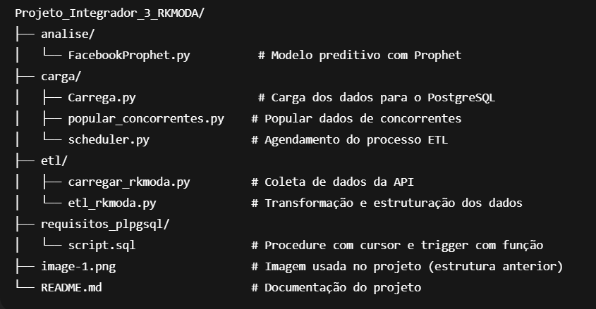

# Projeto Integrador - RK Moda (PI3) 

| Nome                 | RA          |
|----------------------|-------------|
|Eduardo Cardoso       |2041382411017|
|Gabrielly Silva       |2041382411023|
|Jennyfer Santos       |2041382411041|
|Murilo Matos          |2041382411030|
|Ricardo Bertolessi    |2041382411031|

Este repositório contém a implementação do Projeto Integrador do 3º semestre da Fatec Ipiranga, com foco em análise de dados e automação de processos de uma loja de moda digital chamada **RK Moda**

---

## Objetivo

Criar uma solução integrada de coleta, transformação, análise e previsão de dados a partir de uma base simulada da loja RK Moda, utilizando ferramentas como **PostgreSQL**, **Python**, **PL/pgSQL**, **Machine Learning** e **agendamento de ETL**.

---

## Estrutura do Projeto

](image.png)

## Requisitos Atendidos

### 1. Stored Procedure com Cursor Dinâmico (PL/pgSQL)

Estatística calculada: Frequência de ocorrência dos produtos mais vendidos, com base na soma da quantidade vendida.

Relevância: Essa informação é importante para identificar quais produtos têm maior saída e apoiar decisões de estoque e marketing na loja de roupas femininas.

Tabelas e colunas usadas: A procedure percorre a tabela dw.fato_pedidos_rk, utilizando as colunas id_produto, nome_produto e qtd_produto por meio de um cursor com query dinâmica.
---

### 2. Trigger com função associada (PL/pgSQL)

Criamos um trigger chamado trigger_log_pedido, associado à função registrar_log_pedido, que é executado automaticamente sempre que um novo pedido é inserido na tabela pedidos.

O objetivo é registrar na tabela log_pedidos informações como o ID do pedido, ID do cliente e um timestamp. Essa automação permite auditar facilmente quando e por quem os pedidos foram registrados, sendo útil para rastreabilidade, segurança e análises futuras.

Essa abordagem reduz erros manuais e permite uma visão clara das operações sensíveis do sistema.

---

### 3. Utilização de modelo de IA para previsão de tendências

Implementamos um modelo de **classificação de receita mensal** com base nos dados do banco de dados, utilizando o algoritmo **Facebook Prophet** para prever o faturamento dos próximos 6 meses.

**Etapas envolvidas:**
- Leitura dos dados com `SQLAlchemy` direto do PostgreSQL;
- Treinamento do modelo com a biblioteca `Prophet`;
- Avaliação visual e gravação dos resultados no banco de dados;
- Gráficos com previsão e intervalos de confiança.

**Validação cruzada:** realizada implicitamente pelo Prophet ao ajustar tendência e sazonalidade (adicionalmente podem ser aplicados métodos manuais via sklearn para testes futuros).

---

## ⚙️ Tecnologias Utilizadas

- Python 3.10
- PostgreSQL 15
- PL/pgSQL
- SQLAlchemy
- Pandas
- Openpyxl
- Prophet (Facebook)
- Schedule
- Tqdm
- Asyncio + httpx
- Grafana
---

## Como executar

1. Configure seu banco PostgreSQL local com o nome `rk moda` e `pi3_rkmoda`;
2. Execute o script `carregar_rkmoda.py` para baixar e transformar os dados;
3. Utilize `Carrega.py` para popular o banco de dados;
4. Rode o modelo preditivo com `FacebookProphet.py`;
5. Use `scheduler.py` para agendar o processo diário de ETL.

---

## Contribuição

Sugestões de melhoria, refatoração ou novos insights analíticos são bem-vindos! Faça um fork, abra uma issue ou mande um PR.

---

## Versão

**v2.0.0** – Primeira entrega completa do Projeto Integrador III.
